<link rel="stylesheet" href="css/main.css">

# Create Split Images

Now that your video's connected, let's make some splits!

## Taking screenshots

Press the Take Screenshot button to take a screenshot of the currently displayed video frame.

<figure>
  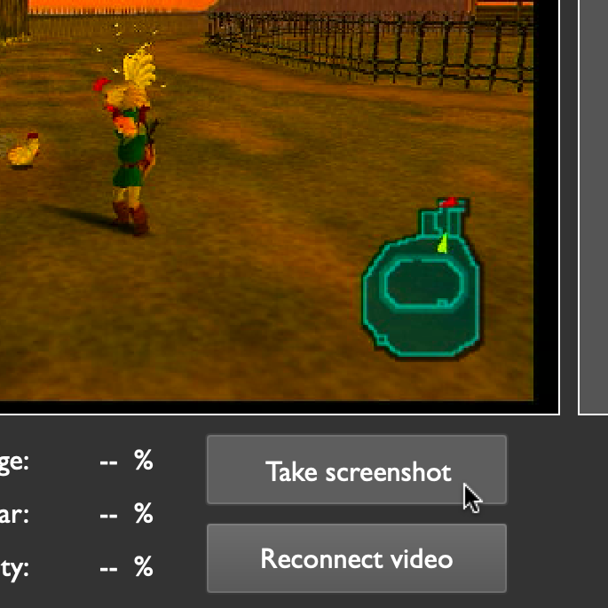
</figure>

By default, split images are read from and saved to your home directory. Choose a custom folder by clicking the Select Split Image Folder button.

You can also open the currently loaded splits folder directly by clicking on the box containing your folder's path.

<figure>
  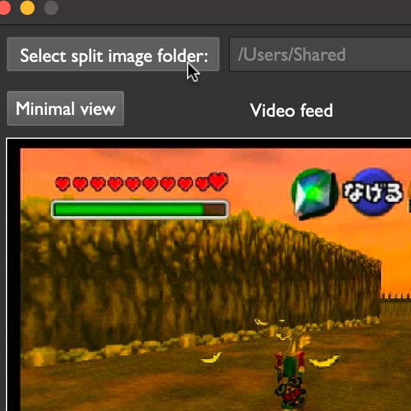
</figure>

{: .tip }
Press the Reset Splits button at any time to reload all images from your splits folder, allowing new and modified images to show up in Pilgrim Autosplitter.

## Editing images

Your speedgame may not have a reliable, repeatable frame for each split — that's fine! All you need is some on-screen element that is consistent, like an icon or some text. Take this example from The Legend of Zelda: Ocarina of Time:

<figure>
  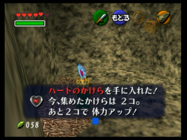
</figure>

I want to split when I pick up a heart piece, but my screen won't look exactly like this every time. However, the words on the screen are always in the same spot. Let's use this knowledge to make a split image that will always match.

{: .tip }
There are lots of free image editors, but these work well with Pilgrim Autosplitter:  
For Windows: [paint.net](https://www.getpaint.net/)  
For MacOS: [krita](https://krita.org/en/download/)

I'll use Krita in this example. In Krita, press `cmd+o` and select the screenshot. You should see a window like this:

<figure>
  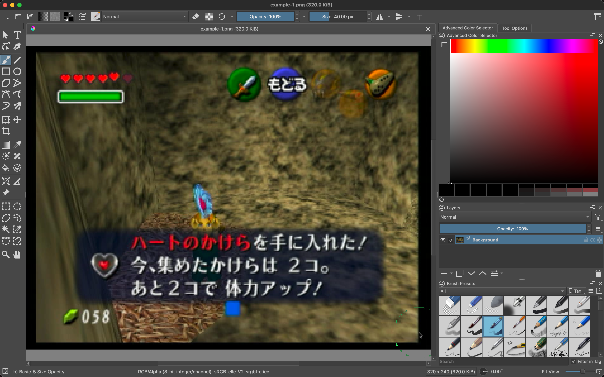
</figure>

First, let's clear away the parts of the image we don't need. Select the rectangular selection tool:

<figure>
  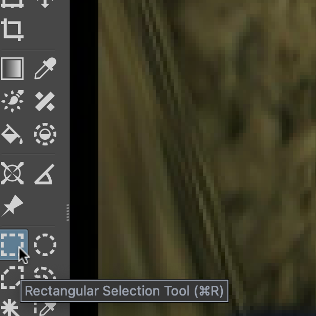
</figure>

Click and drag, then press backspace to erase the parts we don't need:

<figure>
  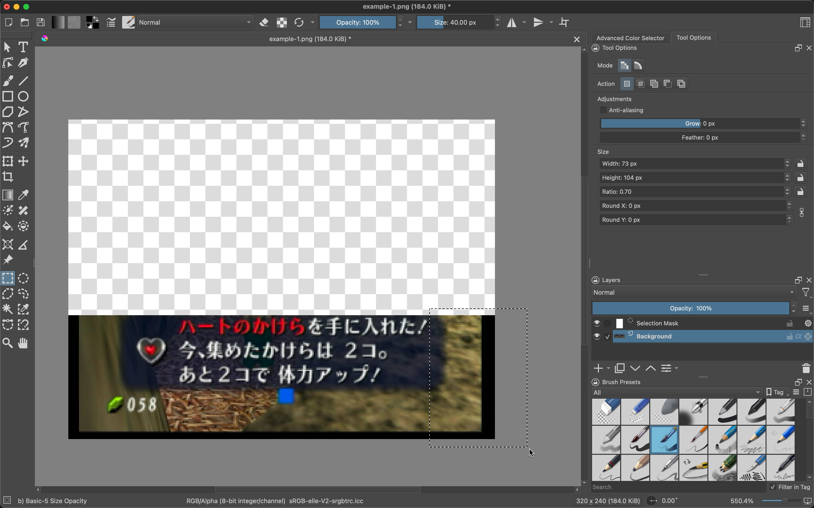
</figure>

You should end up with something like this:

<figure>
  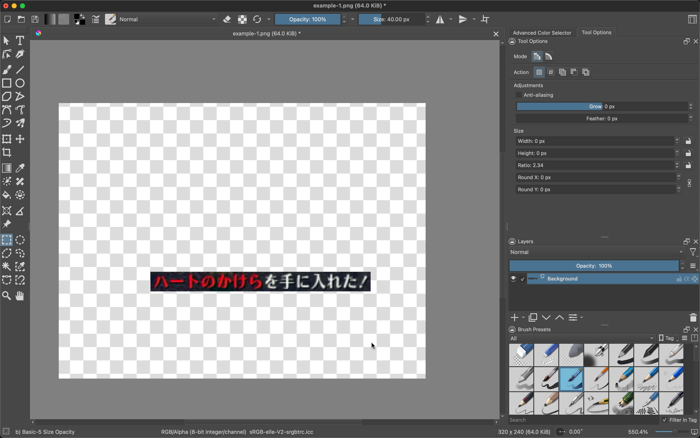
</figure>

Now for those extra pixels around the text. If we leave them in, they'll confuse the splitter, so we need to remove them. Luckily, there's a tool for that!

In the left toolbar, select the contiguous selection tool (often called the "magic wand" tool):

<figure>
  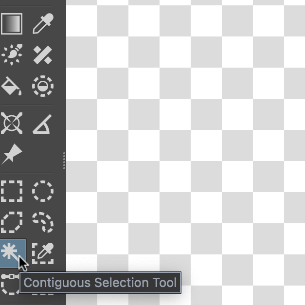
</figure>

We need to configure some settings. Go to the right-hand side of the page, click on the tab that says `Tool Options`, then drag the `Threshold` setting down to about 30.

<figure>
  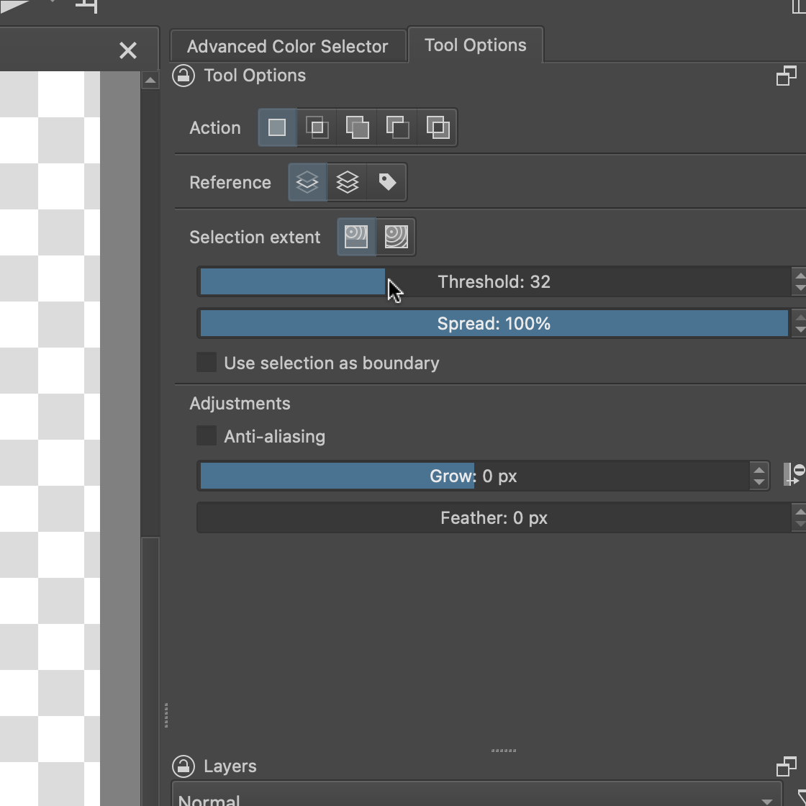
</figure>

Now, click on the dark pixels outside the text. You should be selecting all the pixels outside the text, like this:

<figure>
  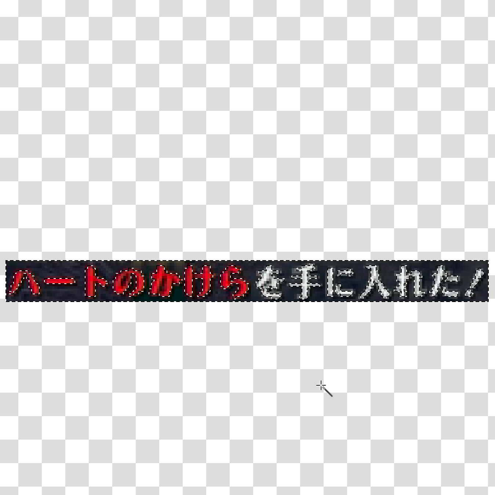
</figure>

When you press delete, you'll be left with just the text:

<figure>
  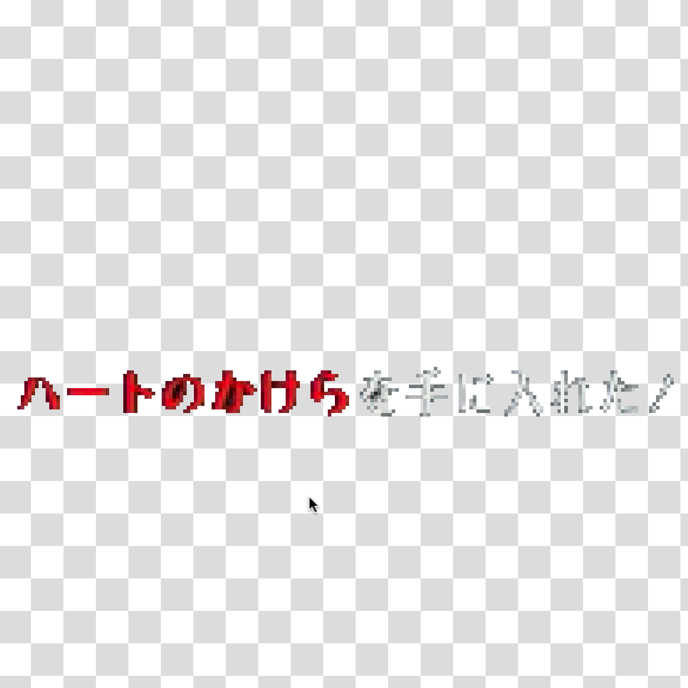
</figure>

In addition, I recommend zooming in and deleting dark spots between the characters, and also trimming any excess dark pixels that stuck to the edges.

{: .note }
You might need to experiment with different `Threshold` values in the `Tool Options` tab. The goal is to find a sweet spot where the magic wand selects all the unwanted pixels and leaves the ones you want alone. If you have trouble, you may also want to uncheck the box next to `Anti-aliasing`.

When you're done, go ahead and save the image: `cmd+s`. To make sure the image is lightweight (this helps Pilgrim Autosplitter run faster by saving CPU), I recommend using the following settings:

<figure>
  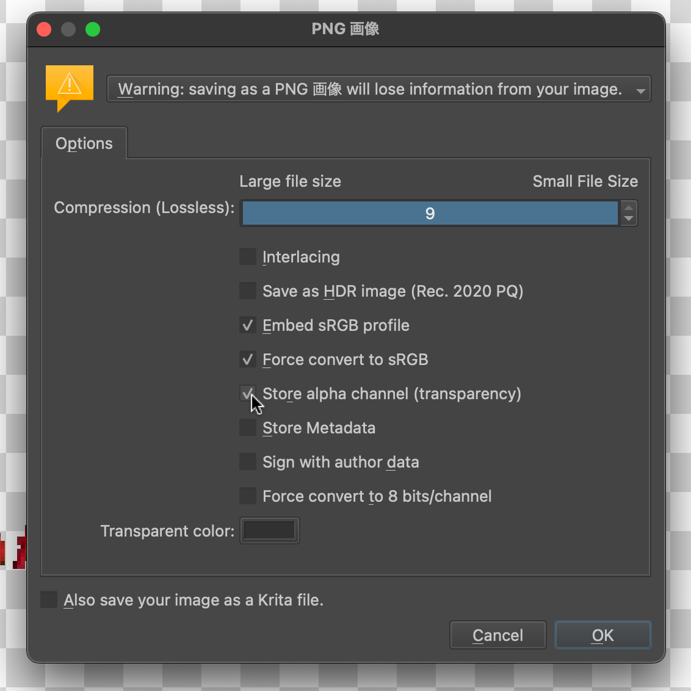
</figure>

Make sure `compression` is set at its highest value (9 here). The most important checkbox to fill is `Store alpha channel`; without it, there won't be any transparency, and the split image won't work like it's supposed to (Pilgrim Autosplitter only compares non-transparent pixels, so if the whole image is non-transparent, it will look for an entire blank screen with our selection on it — not what we want).

Using this method, you'll end up with images that will match your splits every time. Make sure to experiment to find out what works for you!
