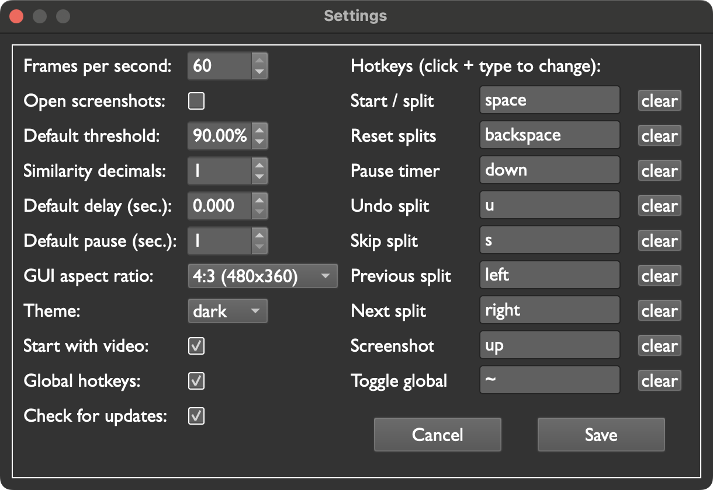

<link rel="stylesheet" href="css/main.css">

# Settings

To open the settings menu, go to the "Pilgrim Autosplitter" context menu and click `Settings`.

{: .tip }
You can also open the settings menu by pressing `ctrl+.` (on Windows) or `cmd+.` (on Mac).

This is the settings menu:

<figure>
  
</figure>

## Frames per second

{: .important }
Lowering this setting is a great way to save CPU.

The amount of frames per second Pilgrim Autosplitter captures and processes.

A decent rule of thumb for the minimum needed FPS is to use half your game's FPS. If you play Super Mario 64, this would be 15 (Super Mario 64 runs at 30 FPS). You might be able to use an even lower FPS if your split images use elements that stay on the screen for a long time. However, iff your split images contain elements that are only onscreen for one frame, you should use at least your game's FPS.

Of course, there's no downside to using a higher FPS -- it just comes with a higher performance cost.

Framerates higher than 60 FPS are not supported.

Minimum: `10`  
Default: `30`  
Maximum: `60`

## Open screenshots

When selected, Pilgrim Autosplitter will open automatically open screenshots in your default image viewer.

Default: `disabled`

## Default threshold

The current video feed and the current split image must match this much for Pilgrim Autosplitter to split.

If splits are happening too easily, try increasing this value. 

This value [can be adjusted](#threshold) for individual splits.

Minimum: `0%`  
Default: `90%`  
Maximum: `100%`

## Similarity decimals

The amount of decimal places Pilgrim Autosplitter shows when comparing splits to video.

Default: `0`  
Maximum: `2`

## Default delay

Pilgrim Autosplitter will wait this many seconds to split after finding a match.

This value [can be adjusted](#delay) for individual splits.

Minimum: `0 seconds`

## Default pause

Pilgrim Autosplitter will wait this many seconds AFTER splitting before starting to look for the next match. This is a great option to save computing power!

This value [can be adjusted](#pause) for individual splits.

Minimum: `1 second`

## GUI aspect ratio

Customize the size of your video and split images.

Supported resolutions:

* `4:3 (480 x 360)` (default)
* `4:3 (320 x 240)`
* `16:9 (512 x 288)` (great if you're playing newer games)
* `16:9 (432 x 243)`

{: .note }
This setting does NOT affect the accuracy of matching splits to video. (For image matching, Pilgrim Autosplitter relies on internal images that are always the same size.)

## Theme

Choose a theme!
Available options:

* `dark mode` (default)
* `light mode`

## Start with video

If enabled, Pilgrim Autosplitter will connect to the first available video source on startup.

Default: `disabled`

## Global hotkeys

If enabled, [hotkeys](#hotkeys) will work no matter what app is in focus.  
If disabled, hotkeys will only work when Pilgrim Autosplitter is in focus. (For an exception to this behavior, see [Toggle global](#toggle-global).)

Default: `enabled`

{: .note }
For global hotkeys to work on MacOS, you need to give Terminal [accessibility privileges](https://support.apple.com/guide/mac-help/allow-accessibility-apps-to-access-your-mac-mh43185/mac) in Privacy and Security in System Settings. If that doesn't work, you can also run Pilgrim Autosplitter as root. In addition, on Linux you must run Pilgrim Autosplitter as root. This allows Pilgrim Autosplitter to monitor your keyboard for inputs even when the app's not in focus.

## Check for updates

When enabled, Pilgrim Autosplitter will automatically check if a new version has been released on launch.

Upgrading to a new version doesn't erase your settings; they are saved by the system.

Default: `enabled`

## Always on top

When enabled, Pilgrim Autosplitter will stay on top of other apps, even when not in focus.

Default: `disabled`

# Hotkeys

Pilgrim Autosplitter has 9 optional hotkeys.

A hotkey can only be bound to one key (i.e. you CANNOT use a combination of keys, such as `ctrl+m`).

The same key can be used for more than one hotkey. For instance, you could bind the same key to `split` and `screenshot`. Then, every time Pilgrim Autosplitter splits, it will take a screenshot too.

{: .note }
Pilgrim Autosplitter will not send or detect hotkey presses when the [settings menu](#settings) is open.

{: .warning }
Using the same key for hotkeys that do opposite things (e.g. `skip` and `undo`) may result in unexpected behavior. Use common sense!

## Split
Go to the next split. This is the key Pilgrim Autosplitter presses when a split image is matched.

## Reset splits

Go back to the first split. Also refreshes your split images, so pressing `reset` will load any new or modified images. Pilgrim Autosplitter presses this when it finds a match to your reset image, if you have one.

## Pause timer

Pilgrim Autosplitter presses this key when it matches a [pause type](#pause-type) split.

## Undo split

Go back one split.

## Skip split

Go forward one split.

## Previous split

Go back one split. This hotkey is included along with [undo split](#undo-split) so you can scroll through splits without affecting the speedrun timer.

## Next split

Go forward one split. This hotkey is included along with [skip split](#skip-split) so you can scroll through splits without affecting the speedrun timer.

## Screenshot

Take a screenshot.

## Toggle global

Enable or disable [global hotkeys](#global-hotkeys). Convenient if you like to use the keyboard during speedruns.

{: .note }
If assigned, this hotkey is ALWAYS enabled even if [global hotkeys](#global-hotkeys) are disabled.
