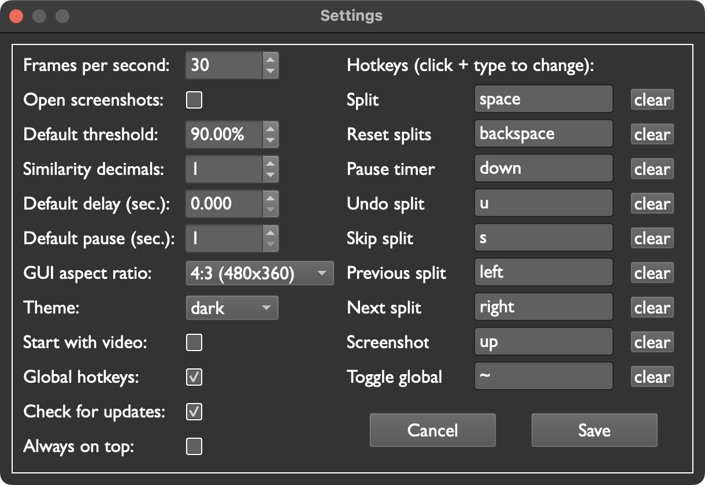

<link rel="stylesheet" href="css/main.css">

# Settings

This is the settings menu:

<figure>
  
</figure>

## Frames per second

The amount of frames per second Pilgrim Autosplitter captures and processes. The lower the FPS, the less energy used, but you might miss frames if you lower the FPS below your capture card's limit or your game's framerate. 

Minimum: `20`  
Maximum: `60`

## Open screenshots

When selected, Pilgrim Autosplitter will open automatically open screenshots for you in your computer's default image viewer.

## Default threshold

The current video feed and the current split image must match this much for Pilgrim Autosplitter to split.

If splits are happening too often, try increasing this value. 

This value [can be adjusted](#threshold) for individual splits.

Minimum: `0%`  
Default: `90%`  
Maximum: `100%`

## Similarity decimals

The amount of decimal places Pilgrim Autosplitter shows when comparing splits to video.

Default: `0`  
Maximum: `2`

## Default delay

Pilgrim Autosplitter will wait this many seconds to split after finding a match.

This value [can be adjusted](#delay) for individual splits.

Minimum: `0 seconds`

## Default pause

Pilgrim Autosplitter will wait this many seconds AFTER splitting before starting to look for the next match. This is a great option to save computing power!

This value [can be adjusted](#pause) for individual splits.

Minimum: `1 second`

## GUI aspect ratio

Customize the size of your video and split images. 

Supported resolutions:

* `4:3 (480 x 360)` (default)
* `4:3 (320 x 240)`
* `16:9 (512 x 288)` (great if you're playing newer games)
* `16:9 (432 x 243)`

{: .note }
This setting does NOT affect the accuracy of matching splits to video. (For image matching, Pilgrim Autosplitter relies on internal images that are always the same size.)

## Theme

Choose a theme!
Available options:

* `dark mode` (default)
* `light mode`

## Start with video

If enabled, Pilgrim Autosplitter will connect to the first available video source on startup.

Default: `disabled`

## Global hotkeys

If enabled, hotkeys will work no matter what app is in focus.  
If disabled, hotkeys will only work when Pilgrim Autosplitter is in focus.

Default: `enabled`

# Hotkeys

Pilgrim Autosplitter has 9 optional hotkeys. 

Each hotkey can be assigned to only one key (i.e. NOT a combination of keys, such as `ctrl+m`). Similarly, each key can only be used for one hotkey.

{: .note }
If you assign the same key to more than one hotkey, the highest hotkey in the list will take precedence. For instance, if you assign `space` to the `start / split` hotkey and the `screenshot` hotkey, pressing `space` will trigger a split, but will not take a screenshot.

## Start / split
Go to the next split. This is the key Pilgrim Autosplitter presses when a split image is matched.

## Reset splits

Go back to the first split. Also refreshes your split images, so pressing `reset` will load any new or modified images.

## Pause timer

Pilgrim Autosplitter presses this key when it matches a [pause type](#pause-type) split.

## Undo split

Go back one split.

## Skip split

Go forward one split.

## Previous split

Go back one split. This hotkey is included along with `undo` so you can scroll through splits without affecting the speedrun timer.

## Next split

Go forward one split. This hotkey is included along with `skip` so you can scroll through splits without affecting the speedrun timer.

## Screenshot

Take a screenshot.

## Toggle global

Enabled or disable [global hotkeys](#global-hotkeys). Convenient if you like to use the keyboard during speedruns.
