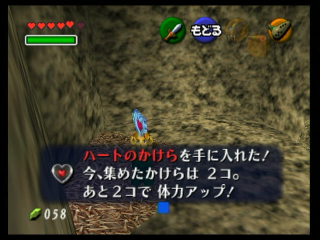
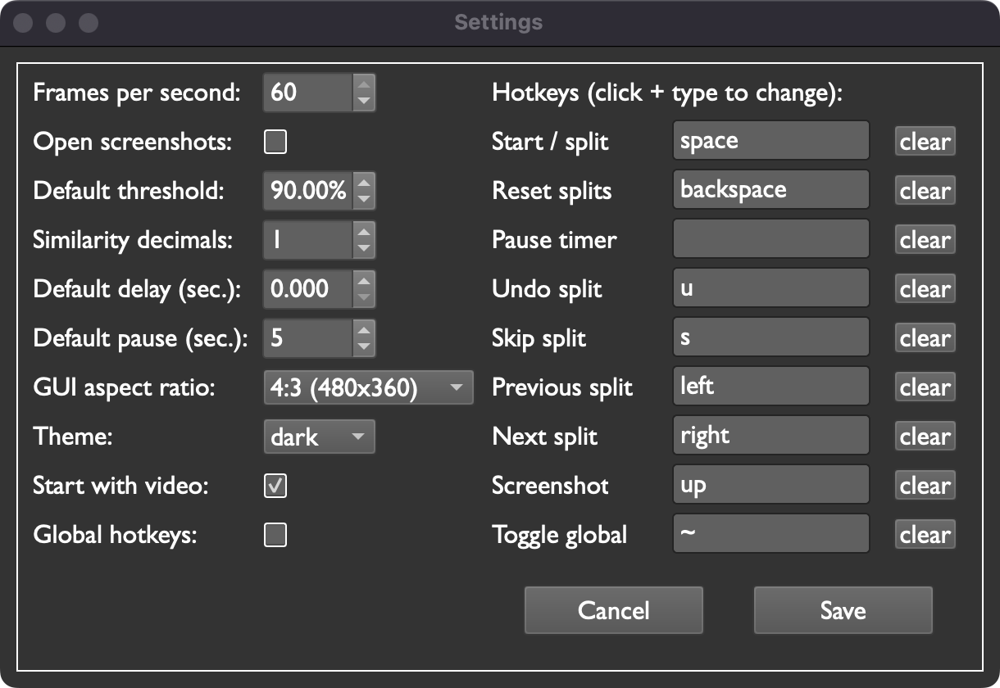

# Pilgrim Autosplitter for MacOS

Finally, an image-based autosplitter for MacOS!

Table of Contents
=================

* [Pilgrim Autosplitter](#pilgrim-autosplitter)
   * [Introduction](#works-on-macos-and-windows)
   * [Usage](#usage)
      * [Connect video](#connect-video)
      * [Create split images](#create-split-images)
   * [Settings](#settings)
   * [Hotkeys](#hotkeys)
   * [Customize Splits](#customize-splits)
      * [Threshold](#threshold)
      * [Delay](#delay)
      * [Pause](#pause)
      * [Loops](#loops)
      * [Special Options](#special-options)
   * [Installation](#installation)
      * [MacOS](#macos)
      * [Windows](#windows)
      * [Linux](#linux)

## Works on MacOS and Windows

Are you a speedrunner who wants to use an autosplitter, but doesn't have access to a Windows PC?

Pilgrim Autosplitter was designed for MacOS users to fill the gap left by other image-based autosplitters, which generally only support Windows.

This program has only been minimally tested on Windows, so there may be unknown issues. If you encounter any problems, submit an issue or open a pull request.

I don't have plans to introduce Linux support, but if you're interested in adding such support, feel free to open a pull request.

## Usage

### Connect video

#### Capture Card

If you're using a capture card, all you need to do is have it connected to your computer. In Pilgrim Autosplitter, click the Next Source button until your capture card feed appears.

(Note: because of limitations related to video capturing backends on MacOS, you have to scroll through each source until you find the one you want. This might lead to triggering webcams or other connected devices, so don't be alarmed; no one is spying on you.)

#### OBS Virtual Camera

If you're not using a capture card, the recommended method is to use OBS Virtual Camera. You can select any open program on your computer in OBS. Once OBS Virtual Camera is open, click the Next Source button until your game feed appears.

### Create split images

Now that your video's connected, let's make some splits!

Press the Take Screenshot button to take a screenshot of the currently displayed video frame. By default, these are saved to your home directory. Choose a custom folder by clicking the "Select Split Image Folder" button in the top left.

Your speedgame may not have a reliable, repeatable frame for each split. That's fine-- try to identify some on-screen element the split always has, such as an icon or some text. See, for example, this split from The Legend of Zelda: Ocarina of Time:

My screen won't look exactly like this every time. However, the words on the screen are always in the same spot. I can use this fact to create a split image that will always return a match.

You can use any image editing software, but I recommend either of the following free tools:

Windows: [paint.net](https://www.getpaint.net/)

MacOS: [krita](https://krita.org/en/download/)

In the application you choose, use the magic wand tool to extract unneeded elements from the split image. You'll end up with something like this:

Pilgrim Autosplitter only compares the video feed with non-transparent pixels, so once it finds matching text, it will split.

Press the Reset Splits button at any time to reload all images from your splits folder, allowing new/ modified images to show up in Pilgrim Autosplitter.

## Settings

This is the settings menu:

### Frames per second

The amount of frames per second you want to capture. The lower the frames, the less CPU Pilgrim Autosplitter will use, but you might miss frames if you lower the FPS below your capture card's limit / the game's framerate. Minimum is 20, maximum is 60.

### Open screenshots

Set whether Pilgrim Autosplitter opens images in your computer's default image viewer when you take screenshots.

### Default threshold

The percentage of similarity that the video feed must have with the current split image before splitting. If you find that splits are happening too easily, try increasing the default (or increasing the value just for sensitive splits-- see [Customize Splits](#customize-splits)).

### Default delay

The splitter will pause for this many seconds before splitting after it recognizes an image.

### Default pause

The splitter will not compare the video feed to the next split image for this many seconds after splitting. The minimum allowed pause is 1 second.

### GUI aspect ratio

This changes the size of your video feed and splits. Experiment to find the setting you like. Classic 4:3 resolutions, as well as modern 16:9 resolutions, are supported. This setting will NOT affect the splitter's accuracy, even if you switch aspect ratios frequently, because the splitter relies on internal images that are always the same size.

### Theme

Choose between light mode and dark mode.

### Start with video

Off by default. If checked, Pilgrim Autosplitter will try to connect to video as soon as it opens. Otherwise, you'll need to click Reconnect Video or Next Source to get a video feed connected.

### Global hotkeys

Allow global hotkeys. When off, hotkeys will still work when Pilgrim Autosplitter is in focus, but not when it's in the background.

## Hotkeys

A variety of hotkeys can be configured. Each hotkey can be assigned to only one key (i.e. NOT a combination of keys, such as ctrl+m).

### Start / split

Equivalent to the split hotkey in LiveSplit.

### Reset splits

Equivalent to the reset hotkey in LiveSplit.

### Pause timer

Equivalent to the pause hotkey in LiveSplit.

### Undo split

Equivalent to the undo hotkey in LiveSplit.

### Skip split

Equivalent to the skip hotkey in LiveSplit.

### Previous split

Go back one split. This hotkey is introduced so you can scroll quickly through splits without affecting the speedrun timer.

### Next split

Go forward one split. This hotkey is introduced so you can scroll quickly through splits without affecting the speedrun timer.

### Screenshot

Take a screenshot of the current video frame.

### Toggle global

Allow or disallow global hotkeys by pressing this key. This is convenient if you like to switch back and forth between windows and don't want to mess up your timer when typing.

## Customize Splits

If you want to use settings other than the defaults for individual splits, you can use the split name to set values.

When multiple values are desired, they should be surrounded by underscores except for the last one, like this:

`001_mysplit_[5]_{b}_(85).png` The splitter will wait until the match percent goes above 85% and then lowers back beneath 85% before splitting, and it will not compare the video feed with the next split image for 5 seconds after splitting.

Here are examples for each option:

### Threshold

Change the [default threshold](#default-threshold) for this split only. Insert the value between parentheses `()`.

Example: `001_mysplit_(95).png` The threshold match for this split is 95%.

### Delay

Change the [default delay](#default-delay) for this split only. Insert the value between pound signs `#`.

Example: `001_mysplit_#5#.png` The splitter will wait 5 seconds before splitting after it finds a match.

### Pause

Change the [default pause](#default-pause) for this split only. Insert the value between brackets `[]`.

Example: `001_mysplit_[120].png` The splitter will wait 2 minutes after splitting until it starts searching for the next match.

### Loops

Make a split loop -- this is useful if you are constantly splitting on the same image. The default loop amount is 0, so if you want the loop to repeat itself once, insert the value 1, and so on. Insert the value between `@`s.

Example: `001_mysplit_@1@.png` The splitter will look for matches for this split twice instead of once.

### Special Options

There are three split types you can specify. Each one is specified by placing a letter between braces `{}`. 

These options can be used together, but the dummy option will always override the pause option.

#### Pause split

A pause split is like a regular split, except the splitter will press the pause hotkey instead of the split hotkey when it finds a match. You could use this if, for example, you're running a game that's measured in game time and you regularly have to navigate menus between levels. Insert the value by typing a `p` between braces `{}`.

Example: `001_mysplit_{p}.png` The splitter will pause your timer after it finds a match.

#### Dummy split

Useful if you need to see a certain value to signal a split is coming up, but you don't want the timer to change when you get there. An example might be something like this: your split is a black screen, but you are going to encounter a variable number of black screens before the timer should split. However, you know a certain dialog will appear on the screen immediately before the correct black screen appears. You can set the dialog as a dummy split, and then the splitter will be ready to recognize the black screen when it appears. Insert the value by typing a `d` between braces `{}`.

Example: `001_mysplit_{d}.png` The splitter will wait until it finds a match for this image, then move to the next image without doing anything.

#### Below split

The splitter will not split when it finds a match. Instead, it will wait until the value is no longer matching before it splits.

Example: `001_mysplit_{b}.png` Once the splitter finds a match, it will wait until the video feed is no longer matching before splitting.

## Installation

### MacOS

#### Latest release

Download the latest MacOS build by going to the most recent release (under Releases on the right-hand side of the page) and downloading `pilgrim-autosplitter-v1.0.0.zip` (or whatever the newest version number is). Put it with your other applications, or wherever you want it.

Pros: It's one file, and it's easy to install and use.

Cons: A quirk of building this program on MacOS is that opening it always opens a Terminal window that can't be closed without shutting the program down too. However, the Terminal window can be easily minimzed and ignored. Also, Pilgrim Autosplitter takes a little longer to load when running from the executible (about 30 seconds on my M1 Macbook Air), so keep that in mind.

TROUBLESHOOTING: If you get the following error:

`“Pilgrim Autosplitter.app” cannot be opened because the developer cannot be verified.`

Right-click on the app, hold the `option` key, and press `open`. Then you will have the option to select `open` and ignore the warning. The app won't give the same warning after you open it like this the first time.

#### Download and run using Python

If you know what you're doing, make sure your Python version is 3.9 or greater, then go ahead and run:

`pip3 install -r requirements.txt`

then run the program using:

`python3 pilgrim_autosplitter.py`

If you don't know what you're doing:

You'll need Python 3.9 or newer. [Install it here](https://www.python.org/downloads/).

Download the source files by going to the most recent release (under Releases on the right-hand side of the page) and downloading `Source code (zip)` or `Source code (tar.gz)`. Extract the files and open the folder.

Open the Terminal (if you can't find it, press cmd+space to open Spotlight and search for "Terminal").

Type `pip install -r` (with a space after it) into the open Terminal window, then click and drag the file `requirements.txt` from the program folder into Terminal, and press enter. You'll see a lot of code on your screen. That's good! Python is installing third-party packages needed to run Pilgrim Autosplitter.

In the source code, navigate into the folder called `src`. In Terminal, type `python3` (with a space after it), then click and drag the file called `pilgrim_autosplitter.py` into the Terminal and press enter. If you did everything right, the program should open in about 10 seconds. You can minimize the Terminal window now.

### Windows

#### Download and run using Python

(Note: It bears repeating that this program has only been tested minimally on Windows. It should work, but there might be unencountered problems. If you run into any, feel free to submit an issue or open a pull request.)

If you know what you're doing, make sure your Python version is 3.9 or greater, then go ahead and run:

`pip3 install -r requirements.txt`

then run the program using:

`python3 -m pilgrim_autosplitter.py`

If you don't know what you're doing:

You'll need Python 3.9 or newer. [Install it here](https://www.python.org/downloads/).

Download the source files by going to the most recent release (under Releases on the right-hand side of the page) and downloading `Source code (zip)` or `Source code (tar.gz)`. Extract the files and open the folder.

Open the Command Prompt (if you can't find it, open the start menu and type in "Command Prompt", and it should come up).

Type `pip install -r` (with a space after it) into the command prompt window, then right click and copy the path to the file `requirements.txt` in the program folder, and paste that path into the command prompt and press enter. You'll see a lot of code on your screen. That's good! Python is installing third-party packages needed to run Pilgrim Autosplitter.

In the source code, navigate into the folder called `src`. In the command prompt, type `python3 -m` (with a space after it), then just like before, copy the path to the file `pilgrim_autosplitter.py` (inside the `src` folder), paste it into the command prompt, and press enter. If you did everything right, the program should open in about 10 seconds. You can minimize the command prompt window.

### Linux

I don't have a way to develop on Linux... sorry. You're welcome to try to get things working on Linux, though. Pilgrim Autosplitter is built to be cross-platform, and there shouldn't (in theory) be that much standing in the way of a working Linux implementation.
